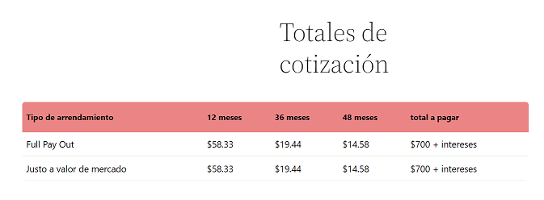

# Plugin cotizador

Plugin que se encarga de generar una cotización cuando ya se tiene una serie de productos.

No se cuenta con documentación, pero el archivo que se encarga de imprimir el total se llama `quote-totals-table.php`, se encuentra en la carpeta `templates/quote/quote-totals-table.php`.

Se tiene que hacer que cuando el usuario escoja la cantidad de meses a arrendar y el tipo de arrendamiento se muestre cuanto debería pagar pon mensualidad.

A lo mejor de forma dinámica que un formulario tenga un boton que diga
"calular" y en su evento onSubmit calcule las mensualidades.

