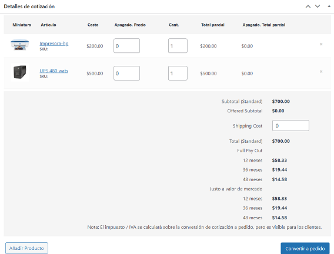

# Plugin cotizador

Plugin que se encarga de generar una cotización cuando ya se tiene una serie de productos.

# Archivos modificados

Solo se modificaron 2 archivos.

- El archivo que se encarga de mostrar los calculos de arrendamiento al cliente llamado `quote-totals-table.php`, se encuentra en la carpeta `templates/quote/quote-totals-table.php`.

- El archivo que se encarga de mostrar los calculos de arrendamiento al administrador llamado `quote-details-table.php`, se encuentra en la carpeta `admin/meta-boxes/quotes/quote-details-table.php`.

# Trabajo restante

Se necesita implementar en ambos archivos las formulas de tipo de arrendamiento en los meses adecuados.

Archivo 1: `quote-totals-table.php`

Archivo 2: `quote-details-table.php`

